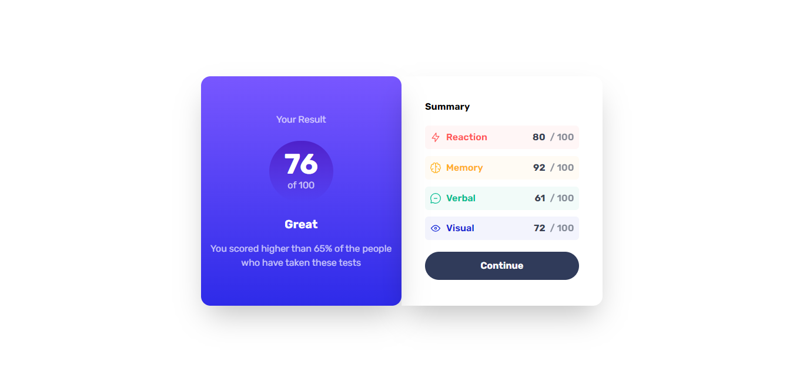
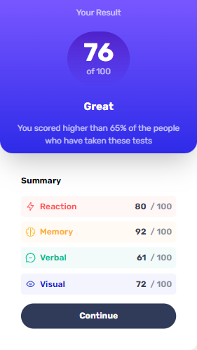

# Frontend Mentor - Results summary component solution

This is a solution to the [Results summary component challenge on Frontend Mentor](https://www.frontendmentor.io/challenges/results-summary-component-CE_K6s0maV). Frontend Mentor challenges help you improve your coding skills by building realistic projects. 

## Table of contents

- [Overview](#overview)
  - [The challenge](#the-challenge)
  - [Screenshot](#screenshot)
  - [Links](#links)
- [My process](#my-process)
  - [Built with](#built-with)
  - [What I learned](#what-i-learned)
  - [Continued development](#continued-development)
  - [Useful resources](#useful-resources)
- [Author](#author)


**Note: Delete this note and update the table of contents based on what sections you keep.**

## Overview

### The challenge

Users should be able to:

- View the optimal layout for the interface depending on their device's screen size
- See hover and focus states for all interactive elements on the page
- **Bonus**: Use the local JSON data to dynamically populate the content

### Screenshot





### Links

- Solution URL: (https://mrlad01-result-summary-task.netlify.app)
- Live Site URL: (https://mrlad01-result-summary-task.netlify.app)

## My process

### Built with

- Semantic HTML5 markup
- CSS custom properties
- Flexbox
- CSS Grid
- Mobile-first workflow
- [React](https://reactjs.org/) - JS library
- [Tailwind CSS](https://tailwindcss.com/) - For styles


### What I learned

I have broadened my knoeledge on responsiveness, escpecially using TailwindCss. I learnt more about screen breakpoints and how to apply them. I learnt how to use SVG as react elements and how to apply them.


```html
<div className="sm:max-2xl:flex sm:max-2xl:w-1/2 sm:max-2xl:h-3/5 xs:max-sm:w-screen xs:max-sm:h-full xs:max-sm:grid" >
```
```css
.proud-of-this-css {
  color: papayawhip;
}
```
```tsx
const Memory = () => {
  return (
    <svg xmlns="http://www.w3.org/2000/svg" width="20" height="20" fill="none" viewBox="0 0 20 20"><path stroke="#FFB21E" strokeLinecap="round" strokeLinejoin="round" strokeWidth="1.25" d="M5.833 11.667a2.5 2.5 0 1 0 .834 4.858"/><path stroke="#FFB21E" strokeLinecap="round" strokeLinejoin="round" strokeWidth="1.25" d="M3.553 13.004a3.333 3.333 0 0 1-.728-5.53m.025-.067a2.083 2.083 0 0 1 2.983-2.824m.199.054A2.083 2.083 0 1 1 10 3.75v12.917a1.667 1.667 0 0 1-3.333 0M10 5.833a2.5 2.5 0 0 0 2.5 2.5m1.667 3.334a2.5 2.5 0 1 1-.834 4.858"/><path stroke="#FFB21E" strokeLinecap="round" strokeLinejoin="round" strokeWidth="1.25" d="M16.447 13.004a3.334 3.334 0 0 0 .728-5.53m-.025-.067a2.083 2.083 0 0 0-2.983-2.824M10 3.75a2.085 2.085 0 0 1 2.538-2.033 2.084 2.084 0 0 1 1.43 2.92m-.635 12.03a1.667 1.667 0 0 1-3.333 0"/></svg>
  )
}

export default Memory
}
```

If you want more help with writing markdown, we'd recommend checking out [The Markdown Guide](https://www.markdownguide.org/) to learn more.


### Continued development

I'll really love to develop more on the screen responsiveness. I have not gotten a hold of the middle sized screens(for tablet devices and so on) and I'm looking forward to developing on that.


### Useful resources

- [tailwindCSS docs](https://tailwindcss.com/docs/) - This helped me for styling. I really liked this pattern and will use it going forward.


## Author

- Frontend Mentor - [@MrLad01](https://www.frontendmentor.io/profile/MrLad01)
- Twitter - [@MrLad01](https://www.twitter.com/MrLad01)
- GitHub- [@MrLad01](https://github.com/MrLad01)


